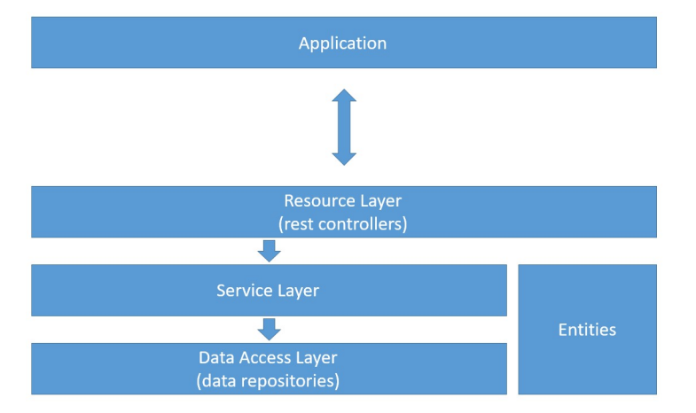
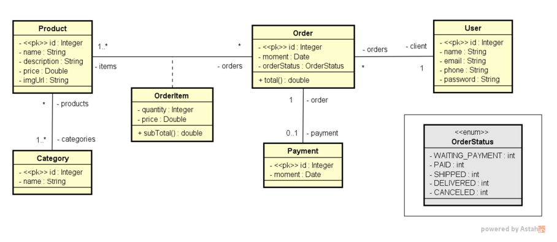
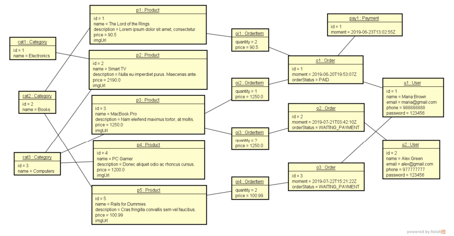
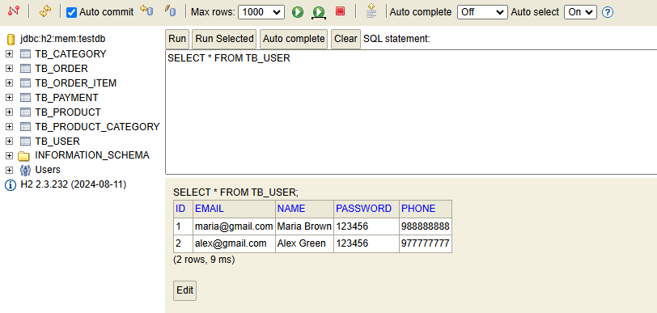

# Webservice Project

This project is a web service that uses a layered architecture and follows the domain model represented by the main entities.

## Project Structure

The project is organized into logical layers to ensure a clear separation of responsibilities:

- **Application Layer**: Interacts with the user or client.
- **Resource Layer**: Contains the REST controllers.
- **Service Layer**: Manages business logic.
- **Data Access Layer**: Handles database access.
- **Entities**: Represents the domain classes.



---

## Domain Model

The domain model defines the main entities of the system and their relationships. This model is the foundation for the system's design and implementation.



---

## Domain Instance

The domain instance provides concrete examples of how the entities and their relationships are represented in the system.



---

## Endpoints

The application runs on `http://localhost:8080`. Below is the list of available endpoints grouped by HTTP methods.

### **GET Endpoints**
- **Retrieve all users**  
  `GET http://localhost:8080/users`

- **Retrieve a user by id**  
  `GET http://localhost:8080/users/{id}`

- **Retrieve all orders**  
  `GET http://localhost:8080/orders`

- **Retrieve a order by id**  
  `GET http://localhost:8080/orders/{id}`

- **Retrieve all categories**  
  `GET http://localhost:8080/categories`

- **Retrieve a category by id**  
  `GET http://localhost:8080/categories/{id}`

- **Retrieve all products**  
  `GET http://localhost:8080/products`

- **Retrieve a product by id**  
  `GET http://localhost:8080/products/{id}`

### **POST Endpoints**
- **Create a new user**  
  `POST http://localhost:8080/users`  
  **Request Body Example**:  
  ```json
  {
    "name": "Zé Henrique",
    "email": "jhsilvamata@gmail.com",
    "phone": "123456789",
    "password": "123"
  }

### **PUT Endpoints**
- **Create a new user**  
  `PUT http://localhost:8080/users/{id}`  
  **Request Body Example**:  
  ```json
  {
    "name": "Zé Henrique Updated",
    "email": "jhsilvamata.update@gmail.com",
    "phone": "123456789"
  }

### **DELETE Endpoints**
- **Delete a user**  
  `DELETE http://localhost:8080/users/{id}` 

---

## H2 Database

The project uses an in-memory **H2 Database** for development and testing purposes. Below is a visual representation of the database with the tables created.



### How to Access the H2 Console

1. Start the application by running:
   ```bash
   ./mvnw spring-boot:run
2. Open your browser and go to the H2 Console:
    - http://localhost:8080/h2-console

3. Use the following credentials to log in:
    - JDBC URL: jdbc:h2:mem:testdb
    - Username: sa
    - Password: (leave empty)
    

## Technologies Used

- **Java** with **Spring Boot** for the backend.
- H2 database for persistence.
- RESTful architecture.
- Postman for endpoints.

## How to Run

1. Clone this repository:
   ```bash
   git clone https://github.com/jhenriquedsm/webservice.git

2. Navigate to the project directory:
    ```bash
    cd webservice

3. Configure the database in the application.properties file.  

4. Run the project:
    ```bash
    ./mvnw spring-boot:run